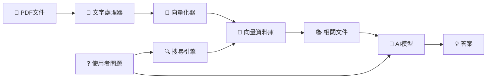

# 🎓 RAG 系統完整教學：從零開始建立智慧文件問答系統

## 📚 目錄
1. [什麼是 RAG？](#什麼是-rag)
2. [系統架構概覽](#系統架構概覽)
3. [環境準備與安裝](#環境準備與安裝)
4. [核心概念詳解](#核心概念詳解)
5. [程式碼逐步解析](#程式碼逐步解析)
6. [實作練習](#實作練習)
7. [常見問題與優化](#常見問題與優化)

---

## 🤔 什麼是 RAG？

### RAG 的全名
**R**etrieval-**A**ugmented **G**eneration（檢索增強生成）

### 為什麼需要 RAG？

想像一個場景：
- 你有一個 AI 助手（如 ChatGPT）
- 你問它：「我們公司最新的產品規格是什麼？」
- AI 回答：「抱歉，我不知道你們公司的內部資料」

**問題在哪？**
1. AI 模型的知識有截止日期（例如：2024年之前）
2. AI 不知道你的私有資料（公司文件、個人筆記等）
3. AI 可能會「幻想」（Hallucination）出錯誤答案

**RAG 如何解決？**
```
使用者問題 → 搜尋相關文件 → 將文件內容給 AI → AI 基於文件回答
```

### 生活化比喻

RAG 就像是一個「開卷考試」系統：
- **傳統 AI**：閉卷考試，只能用腦中記憶回答
- **RAG 系統**：開卷考試，可以查閱資料後回答

---

## 🏗️ 系統架構概覽

### RAG 系統的五大組件



### 各組件功能說明

| 組件 | 功能 | 比喻 |
|------|------|------|
| **PDF 處理器** | 讀取PDF，提取文字 | 像是把書本內容打字到電腦 |
| **文字切塊器** | 將長文切成小段落 | 像是把長文章分成段落筆記 |
| **向量化器** | 將文字轉換成數字 | 像是給每段文字一個座標 |
| **向量資料庫** | 儲存並搜尋向量 | 像是智慧型圖書館索引 |
| **AI 生成器** | 根據資料產生答案 | 像是一個會讀資料的專家 |

---

## 💻 環境準備與安裝

### 步驟 1：建立虛擬環境

```bash
# 為什麼需要虛擬環境？
# 想像虛擬環境就像是一個獨立的工作室，
# 不會影響到電腦上其他專案

# 建立虛擬環境
python -m venv llm_pure

# 啟動虛擬環境（Linux/Mac）
source llm_pure/bin/activate

# 啟動虛擬環境（Windows）
llm_pure\Scripts\activate
```

### 步驟 2：安裝必要套件

```bash
# 安裝基本套件
pip install sentence-transformers  # 文字轉向量工具
pip install faiss-cpu             # 向量資料庫
pip install pypdf                 # PDF 讀取工具
pip install numpy                 # 數學運算
pip install requests              # 網路請求
pip install transformers          # AI 模型框架
pip install torch                 # 深度學習框架
```

### 套件功能說明

```python
# 每個套件的作用解釋
"""
1. sentence-transformers
   - 功能：將文字轉換成向量（數字表示）
   - 比喻：像是翻譯官，把人類語言翻譯成電腦懂的數字

2. faiss-cpu
   - 功能：Facebook 開發的向量搜尋引擎
   - 比喻：像是超快速的圖書館目錄系統

3. pypdf
   - 功能：讀取 PDF 檔案內容
   - 比喻：像是 PDF 閱讀器的程式版本

4. transformers
   - 功能：使用各種 AI 模型
   - 比喻：像是 AI 模型的管理器
"""
```

---

## 🎯 核心概念詳解

### 概念 1：文字嵌入（Text Embedding）

#### 什麼是嵌入？

```python
# 傳統方式：文字就是文字
text1 = "我愛吃蘋果"
text2 = "我喜歡吃水果"
# 電腦不知道這兩句話相關

# 嵌入方式：文字變成向量（數字座標）
vector1 = [0.2, 0.8, 0.5, ...]  # 768個數字
vector2 = [0.3, 0.7, 0.6, ...]  # 768個數字
# 電腦可以計算兩個向量的距離，判斷相似度
```

#### 視覺化理解

想像每個句子都是空間中的一個點：
- 相似的句子：點靠得很近
- 不同的句子：點離得很遠

```
    3D空間示意圖

         "貓咪"
           ●
          / \
         /   \
    "小貓" ● ● "貓科動物"


    ● "汽車"（離貓相關詞很遠）
```

### 概念 2：文檔切塊（Chunking）

#### 為什麼要切塊？

```python
# 問題：一本書有 500 頁
full_book = "很長很長的內容..." * 10000

# 挑戰：
# 1. AI 模型有輸入長度限制（像是紙張大小有限）
# 2. 搜尋整本書效率很低
# 3. 大部分內容可能不相關

# 解決方案：切成小塊
chunk1 = "第一章第一段..."  # 500 個字
chunk2 = "第一章第二段..."  # 500 個字
# 每塊都可以獨立搜尋和處理
```

#### Chunk Size 和 Overlap 解釋

```python
# 原始文字
text = "A B C D E F G H I J K L M N O"

# Chunk Size = 5, Overlap = 2
chunk1 = "A B C D E"      # 第1塊：字 1-5
chunk2 = "D E F G H"      # 第2塊：字 4-8（與第1塊重疊 D E）
chunk3 = "G H I J K"      # 第3塊：字 7-11（與第2塊重疊 G H）

# 為什麼要重疊？
# 避免重要資訊剛好被切斷在兩塊之間
```

### 概念 3：向量相似度搜尋

#### 如何判斷相似度？

```python
import numpy as np

def cosine_similarity(vec1, vec2):
    """
    餘弦相似度：計算兩個向量的夾角
    - 結果接近 1：非常相似
    - 結果接近 0：無關
    - 結果接近 -1：相反
    """
    dot_product = np.dot(vec1, vec2)
    norm1 = np.linalg.norm(vec1)
    norm2 = np.linalg.norm(vec2)
    return dot_product / (norm1 * norm2)

# 範例
vec_apple = [0.8, 0.2, 0.5]  # "蘋果"的向量
vec_fruit = [0.7, 0.3, 0.4]  # "水果"的向量
vec_car = [0.1, 0.9, 0.2]    # "汽車"的向量

sim1 = cosine_similarity(vec_apple, vec_fruit)  # 0.95（很相似）
sim2 = cosine_similarity(vec_apple, vec_car)    # 0.30（不相似）
```

---

## 📖 程式碼逐步解析

### Part 1: PDF 文件處理

```python
class PDFProcessor:
    """處理 PDF 檔案的類別"""

    def __init__(self, chunk_size: int = 500, chunk_overlap: int = 50):
        """
        初始化設定

        參數解釋：
        - chunk_size: 每個文字塊的大小（字數）
          想像成：每張筆記卡片可以寫 500 個字

        - chunk_overlap: 相鄰塊的重疊字數
          想像成：為了保持連貫，下一張卡片會重複前一張的最後 50 個字
        """
        self.chunk_size = chunk_size
        self.chunk_overlap = chunk_overlap

    def load_pdf(self, pdf_path: str) -> str:
        """
        讀取 PDF 檔案

        流程：
        1. 開啟 PDF 檔案
        2. 逐頁讀取文字
        3. 合併所有頁面的文字
        """
        text = ""
        with open(pdf_path, 'rb') as file:
            pdf_reader = PdfReader(file)

            # 逐頁處理
            for page_num, page in enumerate(pdf_reader.pages):
                page_text = page.extract_text()
                if page_text:
                    # 加入頁碼標記，方便追蹤來源
                    text += f"\n[Page {page_num + 1}]\n{page_text}"

        return text

    def chunk_text(self, text: str, source: str) -> List[Document]:
        """
        將長文字切成小塊

        步驟詳解：
        1. 清理文字（移除多餘空白）
        2. 按照字數切割
        3. 保留重疊部分
        4. 記錄每塊的來源資訊
        """
        # 步驟1：清理文字
        text = re.sub(r'\s+', ' ', text)  # 多個空白變一個
        text = text.strip()                # 移除頭尾空白

        # 步驟2：分割成字詞
        words = text.split()

        chunks = []
        # 步驟3：建立文字塊
        for i in range(0, len(words), self.chunk_size - self.chunk_overlap):
            # 取出 chunk_size 個字
            chunk_words = words[i:i + self.chunk_size]
            chunk_text = ' '.join(chunk_words)

            # 只保留有意義的塊（至少 50 個字元）
            if len(chunk_text) > 50:
                doc = Document(
                    content=chunk_text,
                    metadata={
                        'source': source,      # 來源檔案
                        'chunk_id': len(chunks),  # 第幾塊
                        'start_index': i       # 在原文的位置
                    }
                )
                chunks.append(doc)

        return chunks
```

### Part 2: 文字向量化（Embedding）

```python
class EmbeddingModel:
    """將文字轉換成向量的類別"""

    def __init__(self, model_name: str = "BAAI/bge-large-en-v1.5"):
        """
        載入嵌入模型

        BGE 模型介紹：
        - BAAI: 北京智源人工智能研究院
        - bge: BAAI General Embedding（通用嵌入）
        - large: 模型大小（效果較好但較慢）
        - en: 英文版本（也有中文版 zh）
        - v1.5: 版本號

        輸出維度：1024 維（1024個數字表示一段文字）
        """
        print(f"載入嵌入模型: {model_name}")
        self.model = SentenceTransformer(model_name)
        self.dimension = 1024  # BGE-large 的向量維度

    def encode(self, texts: List[str], batch_size: int = 32) -> np.ndarray:
        """
        將文字列表轉換成向量

        參數說明：
        - texts: 要轉換的文字列表
        - batch_size: 批次處理大小（一次處理幾個）

        處理流程：
        1. 將文字分批（避免記憶體不足）
        2. 每批轉換成向量
        3. 正規化向量（讓長度為1，方便計算相似度）
        """
        embeddings = self.model.encode(
            texts,
            batch_size=batch_size,
            show_progress_bar=True,      # 顯示進度條
            convert_to_numpy=True,       # 轉成 NumPy 陣列
            normalize_embeddings=True    # 正規化（重要！）
        )
        return embeddings
```

### Part 3: 向量資料庫（FAISS）

```python
class FAISSIndex:
    """
    FAISS 向量資料庫

    FAISS 是什麼？
    - Facebook AI Similarity Search
    - 專門用來快速搜尋相似向量
    - 可以在百萬級向量中毫秒級搜尋
    """

    def __init__(self, dimension: int):
        """
        初始化索引

        IndexFlatIP 解釋：
        - Flat: 暴力搜尋（精確但適合小規模）
        - IP: Inner Product（內積），用於正規化後的向量
        """
        self.dimension = dimension
        self.index = faiss.IndexFlatIP(dimension)
        self.documents = []  # 儲存原始文件

    def add_documents(self, documents: List[Document], embeddings: np.ndarray):
        """
        將文件和向量加入資料庫

        步驟：
        1. 向量加入 FAISS 索引
        2. 文件加入列表（保持順序一致）
        """
        # 轉換成 float32（FAISS 要求）
        self.index.add(embeddings.astype('float32'))
        self.documents.extend(documents)
        print(f"已加入 {len(documents)} 個文件到索引")

    def search(self, query_embedding: np.ndarray, k: int = 5) -> List[Tuple[Document, float]]:
        """
        搜尋最相似的文件

        參數：
        - query_embedding: 問題的向量
        - k: 返回前 k 個最相似的結果

        過程解釋：
        1. 計算問題向量與所有文件向量的相似度
        2. 排序找出最相似的 k 個
        3. 返回文件和相似度分數
        """
        # 確保正確的形狀和類型
        query_embedding = query_embedding.reshape(1, -1).astype('float32')

        # 搜尋（scores: 相似度分數, indices: 文件索引）
        scores, indices = self.index.search(query_embedding, k)

        # 組合結果
        results = []
        for idx, score in zip(indices[0], scores[0]):
            if idx < len(self.documents):
                results.append((self.documents[idx], float(score)))

        return results
```

### Part 4: AI 生成器（Gemma3）

```python
class Gemma3Generator:
    """使用 Gemma3 模型生成答案"""

    def __init__(self, model_name: str = "google/gemma-3-1b-it"):
        """
        載入 Gemma3 模型

        模型選擇：
        - gemma-3-1b-it: 10億參數，較快但效果一般
        - gemma-3-4b-it: 40億參數，平衡選擇
        - gemma-3-12b-it: 120億參數，效果最好但最慢

        it = instruction-tuned（經過指令微調）
        """
        print(f"載入 Gemma3 模型: {model_name}")

        # 檢查是否有 GPU
        self.device = torch.device("cuda" if torch.cuda.is_available() else "cpu")
        print(f"使用裝置: {self.device}")

        # 載入分詞器和模型
        self.tokenizer = AutoTokenizer.from_pretrained(model_name)
        self.model = AutoModelForCausalLM.from_pretrained(
            model_name,
            torch_dtype=torch.float16 if torch.cuda.is_available() else torch.float32,
            device_map="auto"  # 自動分配到可用裝置
        )

        # 設定填充標記
        if self.tokenizer.pad_token is None:
            self.tokenizer.pad_token = self.tokenizer.eos_token

    def generate(self, prompt: str, max_new_tokens: int = 512) -> str:
        """
        生成回答

        生成參數解釋：
        - max_new_tokens: 最多生成幾個詞
        - temperature: 創造性（0=保守, 1=創意）
        - top_p: 只考慮機率前 p% 的詞
        - do_sample: 是否隨機採樣
        """
        # 將提示詞轉換成模型輸入
        inputs = self.tokenizer(prompt, return_tensors="pt", padding=True)
        inputs = {k: v.to(self.device) for k, v in inputs.items()}

        # 生成回答
        with torch.no_grad():  # 不需要計算梯度（推理模式）
            outputs = self.model.generate(
                **inputs,
                max_new_tokens=max_new_tokens,
                temperature=0.7,    # 適中的創造性
                do_sample=True,     # 啟用採樣
                top_p=0.9,         # 核採樣
                pad_token_id=self.tokenizer.pad_token_id
            )

        # 解碼成文字
        response = self.tokenizer.decode(outputs[0], skip_special_tokens=True)

        # 移除輸入的提示詞，只保留生成的部分
        response = response[len(prompt):].strip()

        return response
```

### Part 5: 完整 RAG 系統整合

```python
class RAGSystem:
    """整合所有組件的 RAG 系統"""

    def __init__(self):
        """初始化所有組件"""
        print("初始化 RAG 系統...")

        # 1. PDF 處理器
        self.pdf_processor = PDFProcessor(
            chunk_size=500,      # 每塊 500 個字
            chunk_overlap=50     # 重疊 50 個字
        )

        # 2. 嵌入模型
        self.embedding_model = EmbeddingModel()

        # 3. 向量資料庫
        self.vector_db = FAISSIndex(self.embedding_model.dimension)

        # 4. 生成模型
        self.generator = Gemma3Generator()

        # 5. 文件儲存
        self.documents = []

    def load_documents(self, directory: str):
        """
        載入資料夾中的所有 PDF

        完整流程：
        1. 掃描資料夾找 PDF
        2. 逐個讀取 PDF
        3. 切塊處理
        4. 轉換成向量
        5. 存入資料庫
        """
        print(f"\n載入文件從: {directory}")

        # 步驟1: 找出所有 PDF
        pdf_files = Path(directory).glob('*.pdf')

        all_documents = []
        for pdf_file in pdf_files:
            print(f"處理 {pdf_file.name}...")

            # 步驟2: 讀取 PDF
            text = self.pdf_processor.load_pdf(str(pdf_file))

            if text:
                # 步驟3: 切塊
                chunks = self.pdf_processor.chunk_text(text, pdf_file.name)
                all_documents.extend(chunks)
                print(f"  建立了 {len(chunks)} 個文字塊")

        self.documents = all_documents
        print(f"總共載入: {len(self.documents)} 個文字塊")

        if self.documents:
            # 步驟4: 生成向量
            print("\n生成向量嵌入...")
            texts = [doc.content for doc in self.documents]
            embeddings = self.embedding_model.encode(texts)

            # 步驟5: 加入資料庫
            self.vector_db.add_documents(self.documents, embeddings)
            print("文件索引完成！")

    def retrieve(self, query: str, k: int = 5) -> List[Document]:
        """
        檢索相關文件

        流程：
        1. 將問題轉成向量
        2. 在資料庫中搜尋
        3. 返回最相關的 k 個文件
        """
        # 問題向量化
        query_embedding = self.embedding_model.encode([query])

        # 搜尋
        results = self.vector_db.search(query_embedding[0], k=k)

        # 只返回文件（不含分數）
        return [doc for doc, score in results]

    def query(self, question: str, k: int = 5) -> str:
        """
        完整的 RAG 問答流程

        步驟：
        1. 檢索相關文件
        2. 建構上下文
        3. 組合提示詞
        4. 生成答案
        """
        print(f"\n問題: {question}")

        # 步驟1: 檢索
        relevant_docs = self.retrieve(question, k=k)

        if not relevant_docs:
            return "找不到相關文件。"

        # 步驟2: 建構上下文（只用前3個最相關的）
        context = "\n\n".join([
            f"[來源: {doc.metadata['source']}]\n{doc.content[:500]}..."
            for doc in relevant_docs[:3]
        ])

        # 步驟3: 建構提示詞
        prompt = f"""你是一個有幫助的 AI 助手。請根據以下提供的文件內容回答問題。
如果文件中沒有相關資訊，請誠實說明。

文件內容：
{context}

問題：{question}

回答："""

        # 步驟4: 生成答案
        answer = self.generator.generate(prompt)

        return answer
```

---

## 🚀 實作練習

### 練習 1：基本使用

```python
# 完整使用範例
def main():
    # 1. 初始化系統
    rag = RAGSystem()

    # 2. 載入文件
    rag.load_documents("data/")  # 將 PDF 放在 data 資料夾

    # 3. 互動式問答
    while True:
        question = input("\n請輸入問題（輸入 'quit' 結束）: ")

        if question.lower() == 'quit':
            break

        # 取得答案
        answer = rag.query(question)
        print(f"\n答案: {answer}")

if __name__ == "__main__":
    main()
```

### 練習 2：調整參數實驗

```python
# 實驗不同的 chunk_size
chunk_sizes = [100, 300, 500, 1000]

for size in chunk_sizes:
    print(f"\n測試 chunk_size = {size}")

    processor = PDFProcessor(chunk_size=size, chunk_overlap=50)
    # 載入並測試...

    # 觀察：
    # - 小 chunk：更精確但可能缺乏上下文
    # - 大 chunk：更多上下文但可能包含無關資訊
```

### 練習 3：評估檢索品質

```python
def evaluate_retrieval(rag_system, test_questions):
    """評估檢索品質"""

    for question in test_questions:
        print(f"\n問題: {question}")

        # 檢索文件
        docs = rag_system.retrieve(question, k=5)

        # 顯示相關度
        for i, doc in enumerate(docs, 1):
            print(f"{i}. 來源: {doc.metadata['source']}")
            print(f"   內容預覽: {doc.content[:100]}...")

        # 人工評估：這些文件相關嗎？

# 測試問題
test_questions = [
    "什麼是機器學習？",
    "如何訓練神經網路？",
    "Transformer 架構的優點？"
]

evaluate_retrieval(rag, test_questions)
```

---

## 🔧 常見問題與優化

### 問題 1：記憶體不足

```python
# 問題：載入大模型時 OOM (Out of Memory)

# 解決方案 1：使用更小的模型
generator = Gemma3Generator(model_name="google/gemma-3-1b-it")  # 1B 而非 4B

# 解決方案 2：使用量化
model = AutoModelForCausalLM.from_pretrained(
    model_name,
    load_in_8bit=True,  # 8-bit 量化，記憶體減半
    device_map="auto"
)

# 解決方案 3：使用 CPU
model = AutoModelForCausalLM.from_pretrained(
    model_name,
    device_map="cpu"  # 使用 CPU（較慢但不限記憶體）
)
```

### 問題 2：檢索不準確

```python
# 問題：找到的文件不相關

# 解決方案 1：調整 chunk_size
# 太小：缺乏上下文
# 太大：包含太多無關資訊
# 建議：200-1000 之間測試

# 解決方案 2：增加 overlap
processor = PDFProcessor(
    chunk_size=500,
    chunk_overlap=100  # 增加到 100（原本 50）
)

# 解決方案 3：使用更好的嵌入模型
# 英文：BAAI/bge-large-en-v1.5
# 中文：BAAI/bge-large-zh-v1.5
# 多語言：intfloat/multilingual-e5-large
```

### 問題 3：生成品質不佳

```python
# 問題：AI 回答不準確或太簡短

# 解決方案 1：改進提示詞
prompt = f"""你是專業的技術顧問。請根據提供的文件詳細回答。

要求：
1. 引用具體的文件內容
2. 提供完整的解釋
3. 如果資訊不足，說明需要什麼額外資訊

文件：{context}
問題：{question}
詳細回答："""

# 解決方案 2：調整生成參數
outputs = model.generate(
    max_new_tokens=1024,  # 增加長度限制
    temperature=0.3,      # 降低隨機性，更準確
    top_p=0.85,          # 更保守的採樣
    repetition_penalty=1.2  # 避免重複
)

# 解決方案 3：使用更大/更好的模型
# gemma-3-1b-it → gemma-3-4b-it → gemma-3-12b-it
```

### 優化建議總結

| 優化項目 | 建議設定 | 原因 |
|---------|---------|------|
| Chunk Size | 300-500 字 | 平衡上下文與精確度 |
| Overlap | 50-100 字 | 確保連續性 |
| 檢索數量 (k) | 3-5 個 | 太多會引入雜訊 |
| 嵌入模型 | BGE-large | 效果與速度平衡 |
| 生成溫度 | 0.3-0.7 | 事實性 vs 創造性 |

---

## 📊 效能評估指標

### 1. 檢索評估

```python
def evaluate_retrieval_metrics(rag_system, test_set):
    """
    評估檢索品質

    指標：
    - Precision@k: 前 k 個結果中相關的比例
    - Recall@k: 找到的相關文件佔所有相關文件的比例
    - MRR: Mean Reciprocal Rank（第一個相關結果的排名倒數）
    """

    total_precision = 0
    total_recall = 0
    total_mrr = 0

    for question, relevant_docs in test_set:
        retrieved = rag_system.retrieve(question, k=5)

        # 計算 Precision
        relevant_retrieved = 0
        first_relevant_rank = None

        for i, doc in enumerate(retrieved):
            if doc.metadata['source'] in relevant_docs:
                relevant_retrieved += 1
                if first_relevant_rank is None:
                    first_relevant_rank = i + 1

        precision = relevant_retrieved / len(retrieved)
        recall = relevant_retrieved / len(relevant_docs)
        mrr = 1 / first_relevant_rank if first_relevant_rank else 0

        total_precision += precision
        total_recall += recall
        total_mrr += mrr

    n = len(test_set)
    print(f"平均 Precision@5: {total_precision/n:.2f}")
    print(f"平均 Recall@5: {total_recall/n:.2f}")
    print(f"平均 MRR: {total_mrr/n:.2f}")
```

### 2. 生成評估

```python
def evaluate_generation_quality(rag_system, test_questions):
    """
    評估生成品質

    評估面向：
    1. 相關性：回答是否相關
    2. 準確性：資訊是否正確
    3. 完整性：回答是否完整
    4. 流暢性：語言是否通順
    """

    for question in test_questions:
        answer = rag_system.query(question)

        print(f"\n問題: {question}")
        print(f"回答: {answer}")
        print("\n請評分 (1-5):")
        print("- 相關性: ___")
        print("- 準確性: ___")
        print("- 完整性: ___")
        print("- 流暢性: ___")
```

---

## 🎯 課堂練習題

### 初級練習

1. **修改 Chunk Size**
   - 將 chunk_size 改為 300
   - 觀察對檢索結果的影響
   - 記錄處理時間的變化

2. **新增 PDF 文件**
   - 加入一份新的 PDF 到 data 資料夾
   - 重新執行系統
   - 測試新文件的內容是否能被檢索

3. **調整檢索數量**
   - 修改 k 值從 5 改為 3
   - 比較答案品質的差異

### 中級練習

1. **實作中文支援**
```python
# 提示：更換嵌入模型
embedding_model = EmbeddingModel(
    model_name="BAAI/bge-large-zh-v1.5"  # 中文模型
)
```

2. **加入檢索結果顯示**
```python
def query_with_sources(self, question: str):
    """顯示答案和來源"""
    relevant_docs = self.retrieve(question)
    answer = self.generate_answer(question, relevant_docs)

    print(f"答案: {answer}")
    print("\n參考來源:")
    for doc in relevant_docs:
        print(f"- {doc.metadata['source']}, 第 {doc.metadata['chunk_id']} 塊")
```

3. **實作簡單的快取機制**
```python
class CachedRAGSystem(RAGSystem):
    def __init__(self):
        super().__init__()
        self.cache = {}  # 問題->答案的快取

    def query(self, question: str):
        # 檢查快取
        if question in self.cache:
            print("(使用快取結果)")
            return self.cache[question]

        # 正常查詢
        answer = super().query(question)
        self.cache[question] = answer
        return answer
```

### 進階練習

1. **實作混合檢索**
```python
def hybrid_search(self, query: str):
    """
    結合向量搜尋和關鍵字搜尋
    """
    # 向量搜尋
    vector_results = self.vector_search(query)

    # 關鍵字搜尋 (BM25)
    keyword_results = self.keyword_search(query)

    # 合併結果
    combined = self.merge_results(vector_results, keyword_results)
    return combined
```

2. **加入重排序機制**
```python
def rerank_results(self, query: str, documents: List[Document]):
    """
    使用交叉編碼器重新排序
    """
    from sentence_transformers import CrossEncoder

    model = CrossEncoder('cross-encoder/ms-marco-MiniLM-L-6-v2')

    # 計算每個文件與問題的相關性分數
    pairs = [[query, doc.content] for doc in documents]
    scores = model.predict(pairs)

    # 按分數重新排序
    sorted_docs = [doc for _, doc in sorted(
        zip(scores, documents),
        key=lambda x: x[0],
        reverse=True
    )]

    return sorted_docs
```

---

## 💡 延伸學習資源

### 論文與文獻
1. **RAG 原始論文**
   - "Retrieval-Augmented Generation for Knowledge-Intensive NLP Tasks" (2020)
   - 了解 RAG 的理論基礎

2. **FAISS 論文**
   - "Billion-scale similarity search with GPUs" (2017)
   - 了解向量搜尋的原理

3. **Sentence-BERT**
   - "Sentence-BERT: Sentence Embeddings using Siamese BERT-Networks" (2019)
   - 了解文字嵌入的原理

### 線上資源
1. **Hugging Face 課程**
   - https://huggingface.co/course
   - 免費的 NLP 和 Transformers 課程

2. **LangChain 文檔**
   - https://python.langchain.com/
   - 更進階的 RAG 實作框架

3. **OpenAI Cookbook**
   - https://cookbook.openai.com/
   - 包含許多 RAG 相關範例

### 實作專案建議

1. **個人知識庫助手**
   - 將個人筆記、文章建立 RAG 系統
   - 實作搜尋和問答功能

2. **技術文檔問答系統**
   - 收集特定技術的文檔
   - 建立專門的技術問答助手

3. **多語言 RAG 系統**
   - 支援中英文混合檢索
   - 實作跨語言問答

---

## 📝 課後作業

### 作業 1：基礎實作（必做）
建立一個能處理至少 3 個 PDF 文件的 RAG 系統，並能回答相關問題。

**評分標準：**
- 成功載入 PDF（20%）
- 正確切塊和向量化（30%）
- 能檢索相關內容（30%）
- 生成合理答案（20%）

### 作業 2：功能增強（選做）
從以下選項選擇一個實作：

1. **加入網頁介面**
   - 使用 Gradio 或 Streamlit
   - 提供上傳 PDF 功能
   - 顯示檢索來源

2. **支援多種檔案格式**
   - 支援 Word、TXT 檔案
   - 統一處理流程

3. **實作對話記憶**
   - 記住之前的問答
   - 支援追問功能

### 作業 3：效能優化（進階）
優化系統效能，達到以下目標：

- 處理 100 頁 PDF 在 1 分鐘內
- 檢索延遲 < 100ms
- 記憶體使用 < 4GB

**提交內容：**
1. 程式碼（含註解）
2. 測試結果截圖
3. 心得報告（500字）

---

## 🤝 總結

恭喜你完成 RAG 系統的學習！

### 你已經學會了：
✅ RAG 的核心概念和原理
✅ 如何處理和切塊文件
✅ 文字嵌入和向量搜尋
✅ 整合 AI 模型生成答案
✅ 優化和評估系統效能

### 下一步建議：
1. 嘗試不同的模型組合
2. 處理更大規模的文件
3. 加入更多進階功能
4. 部署到實際應用

記住：RAG 系統是連接 AI 與私有資料的橋樑，掌握它將讓你能建立真正有用的 AI 應用！

---

**祝學習愉快！** 🎉

如有問題，歡迎隨時提問討論。